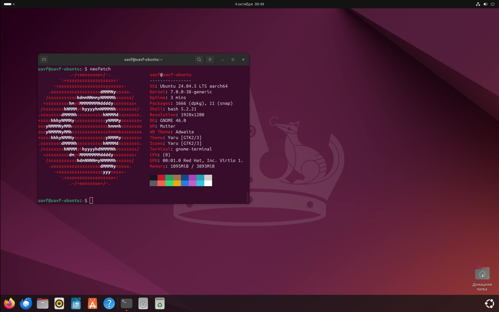
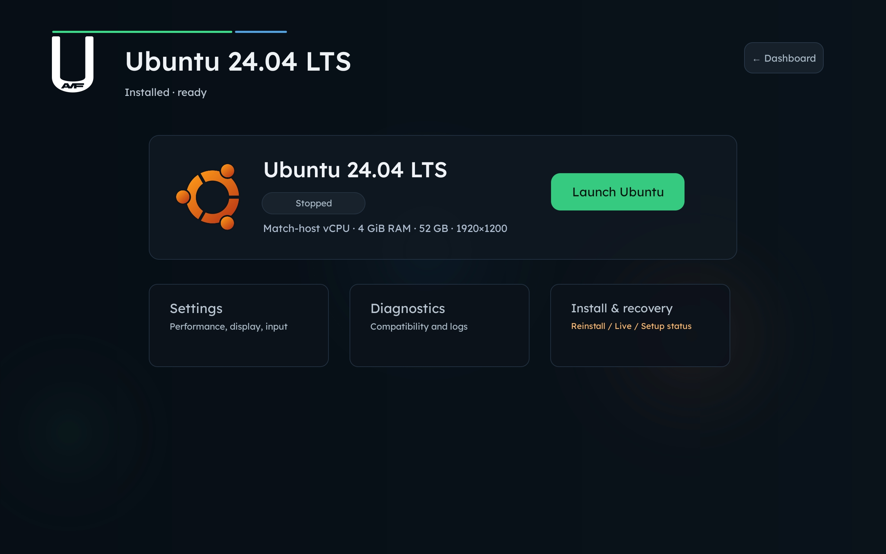
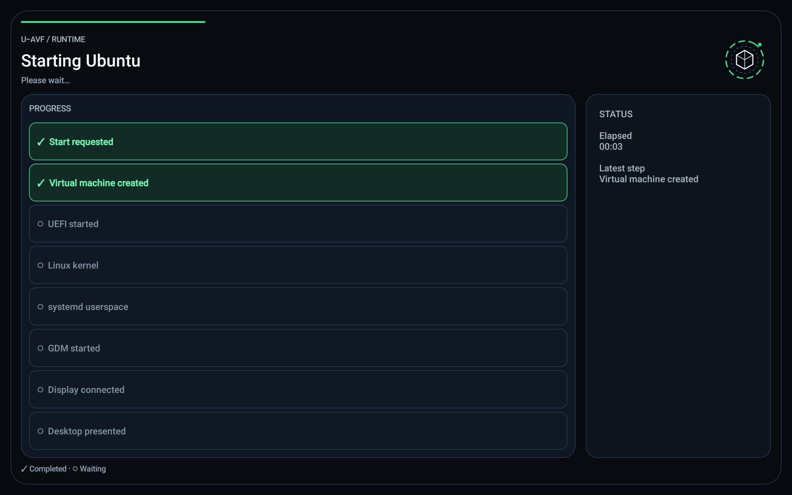

# U-AVF

Non-root Ubuntu Desktop ARM64 on Android Virtualization Framework.
[Download U-AVF 1.0](https://github.com/dt0-imsyu/U-AVF/releases/tag/v1.0.0).

## Screenshots / Скриншоты

Ubuntu GNOME desktop / Рабочий стол Ubuntu GNOME

Workspace controls / Управление workspace

Boot progress / Состояние загрузки

## English

U-AVF launches an installed Ubuntu GNOME desktop without rooting Android, unlocking
the bootloader or flashing. Tested on Samsung Galaxy Tab S11 (GenieZone/crosvm).
The official Ubuntu ISO is not modified. Other devices require their own validation.
The current APK requires Android 16 / API 36 or newer, ARM64 and usable AVF/custom-VM permissions.

### What works

- Managed persistent workspace and automatic Ubuntu installation/bootstrap.
- Hardware OpenGL through VirGL/Mali; encoded 1920×1200 display with 60 FPS capability.
- Keyboard, mouse, touch, internet and audio on the tested configuration.
- Opt-in text clipboard; sharing can be toggled without restarting the VM.
- Device prerequisite checks, workspace settings, diagnostics and storage growth.

Hardware Vulkan is not available on the tested host. Shared folder and universal ISO support are
not promised. Installer flicker, slow App Center and installed-status transition
after the first reboot remain known issues. See [release notes](docs/release-preparation/RELEASE_1.0.md).

### Windows research status

Windows ARM64 on native AVF reaches Windows Boot Manager, `winload.efi` and a
successful UEFI `ExitBootServices` return. Boot after firmware handoff remains
blocked: neither WinPE nor the Windows desktop has been confirmed on this path.
A separate physical ARM timer defect is reproducible, but its causal connection
to the Windows hang remains a strong hypothesis, not a confirmed diagnosis.

### Setup

1. Install the official signed APK from Releases; do not uninstall an existing app
   to bypass a signature mismatch. Normal same-key updates preserve the workspace.
2. Complete onboarding and the real device prerequisite check. If AVF permissions
   are missing, follow the app's USB-debugging/ADB instructions:
   `adb shell pm grant com.example.winavf android.permission.MANAGE_VIRTUAL_MACHINE`
   and `adb shell pm grant com.example.winavf android.permission.USE_CUSTOM_VIRTUAL_MACHINE`.
   Availability depends on the device; a grant command alone does not prove support.
3. Download **Ubuntu 24.04.5 Desktop ARM64** from the official Ubuntu page opened
   by the app. Select the ISO in U-AVF; it checks the supported file.
4. Create a workspace, choose root storage, then Install. Follow Ubuntu Setup for
   language/keyboard/account. Preserve the managed storage layout.
5. Reboot after installation and wait for bootstrap. Use Launch Ubuntu thereafter.
   Temporary Live Session intentionally boots the ISO, not your installed system.
6. Enable Share text clipboard under Input if desired. Reinstall/Delete erase
   Ubuntu data. Clearing Android application data may remove private workspaces.

[Detailed quick start](docs/release-preparation/QUICK_START.md) ·
[Privacy notice](docs/release-preparation/PRIVACY.md) ·
[Third-party compliance](docs/release-preparation/THIRD_PARTY_COMPLIANCE.md).

### Licensing and development

Compatibility statistics are optional and disabled by default. With consent,
reports are sent to the cloud Firebase database for development and optimization,
not stored only locally. Guest files, passwords and clipboard contents are not sent.
See the privacy notice above for the collected fields and retention limitations.

This is a multi-license repository. Only the original files in [LICENSE_SCOPE.md](LICENSE_SCOPE.md)
use [U-AVF Source-Available License 1.0](LICENSE-UAVF.txt), requiring permission for
reuse in another product. Older Apache rights remain; third-party components retain
their licenses. See [LICENSE](LICENSE). This is not a blanket open-source license.

A fresh clone does not include all large platform payloads and cannot build the
tested release standalone. The release build script accepts the official APK as
the tested binary-payload base; third-party source/build provenance review remains incomplete.
No guest disks, personal logs, signing keys or Windows media belong in Git.

## Русский

U-AVF запускает установленную Ubuntu GNOME без root, разблокировки загрузчика и
прошивки Android. Проверено на Samsung Galaxy Tab S11 (GenieZone/crosvm).
Официальный Ubuntu ISO не изменяется. Другие устройства требуют отдельной проверки.
Текущий APK требует Android 16 / API 36 или новее, ARM64 и доступные разрешения AVF/custom VM.

### Что работает

- Постоянный workspace и автоматизированная установка/bootstrap Ubuntu.
- Аппаратный OpenGL через VirGL/Mali; кодированный вывод 1920×1200 с возможностью 60 FPS.
- Клавиатура, мышь, touch, интернет и звук на проверенной конфигурации.
- Добровольный текстовый буфер обмена, переключаемый без перезапуска VM.
- Проверка устройства, настройки workspace, диагностика и расширение диска.

Аппаратный Vulkan на проверенном устройстве недоступен. Универсальная поддержка ISO
и общая папка не обещаются. Известные проблемы: мерцание установщика, медленный
App Center и переход статуса в «установлено» после первого reboot.
Подробнее — [описание релиза](docs/release-preparation/RELEASE_1.0.md).

### Состояние исследования Windows

Windows ARM64 на native AVF доходит до Windows Boot Manager, `winload.efi` и
успешного возврата UEFI `ExitBootServices`. Дальнейшая загрузка после передачи
управления firmware заблокирована: запуск WinPE или рабочего стола Windows на
этом пути не подтверждён. Отдельно воспроизводится дефект физического ARM timer,
но его связь с зависанием Windows — сильная гипотеза, а не доказанная причина.

### Как пользоваться

1. Установите официальный подписанный APK из Releases. Не удаляйте старое приложение
   ради обхода несовпадения подписи: обычное обновление с тем же ключом сохраняет workspace.
2. Пройдите onboarding и настоящую проверку устройства. Если разрешений AVF нет,
   следуйте инструкции приложения по USB debugging/ADB:
   `adb shell pm grant com.example.winavf android.permission.MANAGE_VIRTUAL_MACHINE`
   и `adb shell pm grant com.example.winavf android.permission.USE_CUSTOM_VIRTUAL_MACHINE`.
   Доступность зависит от устройства; успешная команда сама по себе не доказывает совместимость.
3. Скачайте **Ubuntu 24.04.5 Desktop ARM64** с официальной страницы Ubuntu,
   которую открывает приложение. Выберите ISO в U-AVF для проверки поддерживаемого файла.
4. Создайте workspace, задайте размер root-диска и нажмите Install. В Ubuntu Setup
   выберите язык, клавиатуру и учётную запись. Сохраните служебную разметку U-AVF.
5. После установки нажмите перезагрузку и дождитесь bootstrap. Затем используйте
   Launch Ubuntu. Temporary Live Session намеренно загружает ISO, не установленную систему.
6. При необходимости включите Share text clipboard в Input. Reinstall/Delete удаляют
   данные Ubuntu. Очистка данных Android-приложения может удалить приватные workspace.

[Подробная инструкция](docs/release-preparation/QUICK_START.md) ·
[Приватность](docs/release-preparation/PRIVACY.md) ·
[Сторонние компоненты](docs/release-preparation/THIRD_PARTY_COMPLIANCE.md).

### Лицензирование и разработка

Статистика совместимости добровольная и по умолчанию выключена. При согласии
результаты идут в облачную Firebase для разработки и оптимизации, не в локальную
базу. Пароли, гостевые файлы и буфер туда не отправляются. Состав данных и ограничения
хранения описаны в политике приватности выше.

В репозитории несколько лицензий. Только собственные файлы, перечисленные в
[LICENSE_SCOPE.md](LICENSE_SCOPE.md), используют [U-AVF Source-Available License 1.0](LICENSE-UAVF.txt):
для использования в другом продукте нужно разрешение. Старые права Apache и
лицензии сторонних компонентов сохраняются. См. [LICENSE](LICENSE).
Это не единая open-source лицензия на весь репозиторий.

Свежий clone не содержит всех больших platform payloads и не собирает проверенный
релиз самостоятельно. Release builder использует официальный APK как базу
проверенных бинарных payloads. Полная проверка исходников и происхождения сборки
сторонних компонентов ещё не завершена. Гостевые диски, личные логи, ключи подписи
и Windows media не должны попадать в Git.
